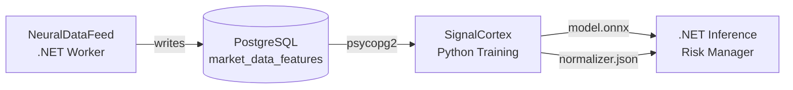
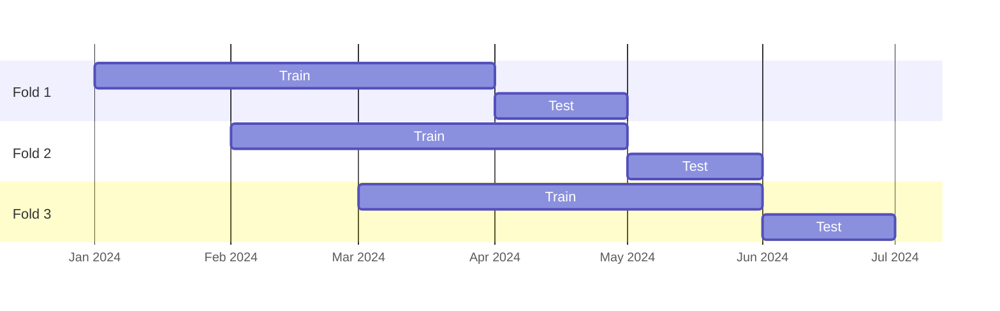

# Omnitech.SignalCortex

Python neural network training and export module for crypto trading signal classification. Part of the OmniBot system — Phase 2 of the NeuralDataFeed pipeline.

Reads labeled OHLCV + technical indicator data from PostgreSQL, trains PyTorch models to classify BUY vs HOLD signals, validates with walk-forward temporal splits, and exports to ONNX for .NET inference.

## System Context



Phase 1 (`Omnitech.NeuralDataFeed`, .NET) continuously collects candlestick data and computes 30+ technical indicators with BUY/HOLD signal labels. This project consumes that data and produces ONNX models for downstream .NET inference.

## Project Structure

```
Omnitech.SignalCortex/
├── configs/
│   ├── default.yaml              # Base configuration (model, training, DB)
│   └── experiments/
│       ├── lstm_5m.yaml          # LSTM on 5m timeframe
│       ├── lstm_15m.yaml         # LSTM on 15m timeframe
│       ├── tcn_5m.yaml           # TCN on 5m timeframe
│       └── multiscale.yaml       # Multi-scale (5m + 15m + 1h)
├── data/
│   ├── db.py                     # PostgreSQL connector and query layer
│   ├── normalizer.py             # Feature scaling with .NET-compatible JSON export
│   ├── dataset.py                # Sliding window PyTorch Dataset and DataLoader factory
│   └── splits.py                 # Walk-forward and simple chronological splits
├── models/
│   ├── __init__.py               # BaseModel interface and build_model factory
│   ├── lstm.py                   # Bi-LSTM + self-attention
│   ├── tcn.py                    # Temporal Convolutional Network (causal + dilated)
│   ├── transformer.py            # Transformer encoder with sinusoidal positional encoding
│   └── multiscale.py             # Multi-scale LSTM (5m / 15m / 1h branches)
├── training/
│   ├── trainer.py                # Training loop, early stopping, LR scheduling, TensorBoard
│   ├── evaluator.py              # ML metrics + financial backtesting (Sharpe, drawdown)
│   └── walk_forward.py           # Walk-forward validation orchestrator
├── export/
│   └── onnx_export.py            # ONNX export + ONNX Runtime validation + normalizer JSON
├── notebooks/
│   └── exploration.ipynb         # EDA: label distribution, feature analysis, class separability
├── outputs/                      # Checkpoints, ONNX models, plots, walk-forward results
├── tests/                        # Unit tests for all layers
├── main.py                       # CLI entry point
└── requirements.txt
```

## Requirements

- Python 3.10+
- NVIDIA GPU recommended (RTX 2060 6GB or better); CPU fallback supported
- PostgreSQL `market_data_db` running on `localhost:5432` (populated by NeuralDataFeed)

```bash
pip install -r requirements.txt
```

Key dependencies: `torch>=2.1`, `onnx>=1.15`, `onnxruntime>=1.16`, `psycopg2-binary`, `scikit-learn`, `tensorboard`, `pandas`, `numpy`.

## Configuration

All settings live in YAML configs. The default config is at `configs/default.yaml`. Experiment configs inherit from the default — only changed keys need to be specified.

```yaml
database:
  host: localhost
  port: 5432
  dbname: market_data_db
  user: postgres
  password: ""  # set DB_PASSWORD env var instead of hardcoding

data:
  pair_name: BTCUSDT
  timeframe: "5m"
  label_column: buy_signal
  scaler: robust  # 'standard', 'robust', 'minmax'

model:
  type: lstm       # 'lstm', 'tcn', 'transformer', 'multiscale'
  window_size: 120
  hidden_size: 128
  num_layers: 2
  dropout: 0.3
  bidirectional: true

training:
  epochs: 100
  batch_size: 256
  learning_rate: 0.001
  early_stopping_patience: 15
  auto_class_weights: true
  walk_forward:
    train_months: 3
    test_months: 1
    step_months: 1
```

Set the database password via environment variable:

```bash
export DB_PASSWORD=yourpassword
```

## CLI Usage

```bash
# Train with simple chronological split (quick experimentation)
python main.py train --config configs/default.yaml

# Evaluate a saved checkpoint on the test set
python main.py evaluate --config configs/default.yaml --checkpoint outputs/best_model.pt

# Export checkpoint to ONNX + normalizer JSON for .NET inference
python main.py export --config configs/default.yaml --checkpoint outputs/best_model.pt

# Run walk-forward temporal validation (5+ folds, the gold standard)
python main.py walk-forward --config configs/default.yaml

# Launch EDA notebook
python main.py eda
```

### Using Experiment Configs

```bash
python main.py train --config configs/experiments/tcn_5m.yaml
python main.py walk-forward --config configs/experiments/lstm_15m.yaml
```

## Model Architectures

All models share a common interface: `forward(x: Tensor) -> Tensor` where input is `(batch, window_size, num_features)` and output is `(batch, 2)` logits for `[HOLD, BUY]`.

### Bi-LSTM + Attention (`lstm`)

```
Input (B, 120, 35)
  -> BatchNorm1d
  -> Bi-LSTM (hidden=128, layers=2, dropout=0.3)
  -> Self-Attention (weighted sum over timesteps)
  -> Linear(256, 64) -> ReLU -> Dropout
  -> Linear(64, 2)
```

### TCN (`tcn`)

```
Input (B, 120, 35)
  -> 4× TemporalBlock (causal dilated conv, dilation=[1,2,4,8])
     channels: [64, 64, 128, 128] — receptive field: 61 timesteps
  -> GlobalAvgPool1d
  -> Linear(128, 64) -> ReLU -> Dropout -> Linear(64, 2)
```

### Transformer (`transformer`)

```
Input (B, 120, 35)
  -> Linear projection (35 -> 128)
  -> Sinusoidal positional encoding
  -> TransformerEncoder (d_model=128, nhead=4, dim_ff=256, layers=2)
  -> Mean pooling over sequence
  -> Linear(128, 64) -> ReLU -> Dropout -> Linear(64, 2)
```

Note: window_size must be ≤ 120 on RTX 2060 to avoid VRAM exhaustion.

### MultiScale (`multiscale`)

Three independent LSTM branches encoding 5m, 15m, and 1h windows simultaneously. Branch embeddings are concatenated before classification. Requires `MultiScaleDataset`. Validate single-scale models first.

## Training Details

### Early Stopping and Checkpointing

The trainer monitors validation F1 and saves the best checkpoint to `outputs/best_model.pt`. Training stops if validation loss does not improve for `early_stopping_patience` epochs (default: 15).

Checkpoint format:
```python
{
    'epoch': int,
    'model_state_dict': ...,
    'optimizer_state_dict': ...,
    'val_f1': float,
    'config': Config,
}
```

### Class Imbalance

Crypto market data is typically ~85% HOLD / ~15% BUY. With `auto_class_weights: true`, the trainer applies inverse-frequency class weights to `CrossEntropyLoss`. Monitor BUY precision (target > 60%) separately from overall accuracy.

### Walk-Forward Validation

Single train/val/test splits are insufficient for time series. The walk-forward validator runs multiple folds across different market conditions:

- Train window: 3 months
- Validation: last 14 days of the training window
- Test window: 1 month following training
- Step: 1 month forward per fold

Results are aggregated (mean ± std per metric) and saved to `outputs/walk_forward_results.json`.



### LR Scheduling

Three schedulers are supported via `training.scheduler`:

| Value | Behavior |
|---|---|
| `reduce_on_plateau` | Halves LR when val loss plateaus (default) |
| `cosine` | CosineAnnealingLR over total epochs |
| `step` | StepLR with step_size=30 |

## Evaluation Metrics

### ML Metrics

Accuracy, precision (BUY class), recall (BUY class), F1, ROC AUC, and confusion matrix.

### Financial Metrics

Trade simulation with fixed stop loss / take profit / timeout rules:

| Parameter | Default |
|---|---|
| Stop loss | -1.5% |
| Take profit | +3.0% |
| Timeout | 20 candles |

Metrics computed: total trades, win rate, avg win/loss PnL, profit factor, total return %, Sharpe ratio, max drawdown %, avg trade duration, Calmar ratio.

Sharpe is annualized using `sqrt(periods_per_year) * mean / std`:
- 5m: 105,120 periods/year
- 15m: 35,040 periods/year

**Target thresholds:** Sharpe ≥ 1.0, win rate ≥ 50%, profit factor ≥ 1.5, max drawdown ≤ 15%.

### Plots

`evaluator.plot_results()` saves PNG charts to `outputs/`:
- `equity_curve.png`
- `confusion_matrix.png`
- `returns_distribution.png`
- `drawdown.png`
- `roc_curve.png`

## ONNX Export

The export workflow produces two artifacts for .NET inference:

```bash
python main.py export --config configs/default.yaml --checkpoint outputs/best_model.pt
# outputs/model.onnx       — ONNX model (opset 17, dynamic batch dimension)
# outputs/normalizer.json  — Normalizer parameters for pre-processing in .NET
```

`normalizer.json` schema:
```json
{
  "scaler_type": "robust",
  "feature_names": ["rsi_14", "rsi_7", ...],
  "no_scale_columns": ["rsi_14", "stoch_rsi_k", ...],
  "scale_columns": ["open_price", "ema_9", ...],
  "center": [50.2, ...],
  "scale": [15.3, ...],
  "feature_order": ["rsi_14", "rsi_7", ...]
}
```

Both files are required for correct .NET inference.

## Feature Set

The default config uses 37 features from the `market_data_features` table:

| Group | Features |
|---|---|
| OHLCV | open_price, high_price, low_price, close_price, volume |
| Momentum | rsi_14, rsi_7, stoch_rsi_k, stoch_rsi_d, roc_14 |
| Trend | ema_9, ema_21, ema_50, ema_200, macd_line, macd_signal, macd_histogram, adx_14 |
| Volatility | bb_upper, bb_middle, bb_lower, bb_pctb, atr_14 |
| Volume | obv, vwap, volume_sma_20, cmf_20 |
| Custom | price_ema9_ratio, price_ema21_ratio, macd_hist_slope |
| S/R | dist_support_pct, dist_resistance_pct, support_strength, resistance_strength, sr_zone_position, num_sr_within_1pct |

Bounded indicators (`rsi_14`, `stoch_rsi_k/d`, `bb_pctb`, `sr_zone_position`, `price_ema9_ratio`, `price_ema21_ratio`) are excluded from scaling via `no_scale_columns`.

## Testing

```bash
python -m pytest tests/ -v
```

Tests cover: config loading, normalizer fit/transform/export, chronological splits, model forward passes (all architectures), evaluator metrics, ONNX export validity, dataset windowing, and trainer convergence.

## GPU Constraints (RTX 2060, 6GB VRAM)

| Setting | Safe Limit |
|---|---|
| batch_size | ≤ 256 |
| window_size (LSTM/TCN) | ≤ 240 |
| window_size (Transformer) | ≤ 120 |
| LSTM hidden_size | ≤ 256 |
| num_layers | ≤ 3 |

Monitor VRAM during Transformer training: `nvidia-smi dmon -s u -d 5`.

## Data Integrity Rules

These constraints are enforced by the pipeline and must not be violated:

1. **No temporal shuffling** — chronological order is preserved across all splits. DataLoader `shuffle=False`.
2. **Normalizer fit on train only** — `fit()` is called once per fold, on training data. Val/test use the same fitted parameters.
3. **Walk-forward over single split** — single-split results are insufficient; 5+ folds is the minimum for production decisions.
4. **No future data in features** — all indicators in `market_data_features` are computed from the candle's own and prior candles only.
