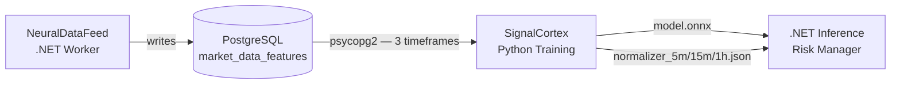
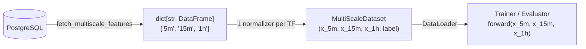
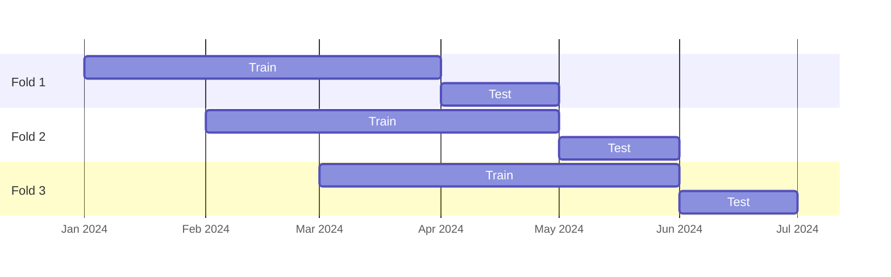

# Omnitech.SignalCortex

Python neural network training and export module for crypto trading signal classification. Part of the OmniBot system — Phase 2 of the NeuralDataFeed pipeline.

Reads labeled OHLCV + technical indicator data from PostgreSQL across three synchronized timeframes (5m, 15m, 1h), trains a multi-scale PyTorch model to classify BUY vs HOLD signals, validates with walk-forward temporal splits, and exports to ONNX for .NET inference.

## System Context



Phase 1 (`Omnitech.NeuralDataFeed`, .NET) continuously collects candlestick data and computes 30+ technical indicators with BUY/HOLD signal labels. This project consumes that data across three synchronized timeframes and produces ONNX models for downstream .NET inference.

## Project Structure

```
Omnitech.SignalCortex/
├── configs/
│   ├── default.yaml              # Base configuration (multiscale model, training, DB)
│   └── experiments/
│       ├── multiscale_lstm.yaml       # Multi-scale with LSTM branch encoders
│       ├── multiscale_tcn.yaml        # Multi-scale with TCN branch encoders
│       └── multiscale_transformer.yaml # Multi-scale with Transformer branch encoders
├── data/
│   ├── db.py                     # PostgreSQL connector — single and multi-timeframe queries
│   ├── normalizer.py             # Feature scaling with .NET-compatible JSON export
│   ├── dataset.py                # MultiScaleDataset: synchronized 3-timeframe windows
│   └── splits.py                 # Walk-forward and simple chronological splits
├── models/
│   ├── __init__.py               # build_model() factory — always returns MultiScaleModel
│   ├── lstm.py                   # Bi-LSTM + self-attention (encoder building block)
│   ├── tcn.py                    # Temporal Convolutional Network (encoder building block)
│   ├── transformer.py            # Transformer encoder (encoder building block)
│   └── multiscale.py             # MultiScaleModel: 3 branches + cross-attention classifier
├── training/
│   ├── trainer.py                # Training loop, early stopping, LR scheduling, TensorBoard
│   ├── evaluator.py              # ML metrics + financial backtesting (Sharpe, drawdown)
│   └── walk_forward.py           # Walk-forward validation across 3 timeframes
├── export/
│   └── onnx_export.py            # ONNX export (3 inputs) + ONNX Runtime validation + normalizer JSONs
├── notebooks/
│   └── exploration.ipynb         # EDA: label distribution, feature analysis, class separability
├── outputs/                      # Checkpoints, ONNX models, plots, walk-forward results
├── tests/                        # Unit tests for all layers (137 tests)
├── main.py                       # CLI entry point
└── requirements.txt
```

## Requirements

- Python 3.10+
- NVIDIA GPU recommended (RTX 2060 6GB or better); CPU fallback supported
- PostgreSQL `market_data_db` running on `localhost:5432` (populated by NeuralDataFeed)

```bash
pip install -r requirements.txt
```

Key dependencies: `torch>=2.1`, `onnx>=1.15`, `onnxruntime>=1.16`, `psycopg2-binary`, `scikit-learn`, `tensorboard`, `pandas`, `numpy`.

## Configuration

All settings live in YAML configs. The default config is at `configs/default.yaml`. Experiment configs inherit from the default — only changed keys need to be specified.

```yaml
database:
  host: localhost
  port: 5432
  dbname: market_data_db
  user: postgres
  password: ""  # set DB_PASSWORD env var instead of hardcoding

data:
  pair_name: BTCUSDT
  decision_timeframe: "5m"           # timeframe used for labels and fold boundaries
  timeframes: ["5m", "15m", "1h"]    # all 3 timeframes consumed per training run
  label_column: buy_signal
  scaler: robust  # 'standard', 'robust', 'minmax'

model:
  type: multiscale                   # only supported architecture
  branch_encoder: lstm               # 'lstm', 'tcn', 'transformer'
  branch_hidden_sizes: [128, 64, 64] # hidden size per branch (5m, 15m, 1h)
  branch_window_sizes: [120, 60, 48] # lookback candles per branch (5m, 15m, 1h)
  num_layers: 2
  dropout: 0.3
  bidirectional: true
  use_attention: true

training:
  epochs: 100
  batch_size: 256
  learning_rate: 0.001
  early_stopping_patience: 15
  auto_class_weights: true
  walk_forward:
    train_months: 3
    test_months: 1
    step_months: 1
```

Set the database password via environment variable:

```bash
export DB_PASSWORD=yourpassword
```

## CLI Usage

```bash
# Train with simple chronological split (quick experimentation)
python main.py train --config configs/default.yaml

# Evaluate a saved checkpoint on the test set
python main.py evaluate --config configs/default.yaml --checkpoint outputs/best_model.pt

# Export checkpoint to ONNX + normalizer JSONs for .NET inference
python main.py export --config configs/default.yaml --checkpoint outputs/best_model.pt

# Run walk-forward temporal validation (5+ folds, the gold standard)
python main.py walk-forward --config configs/default.yaml

# Launch EDA notebook
python main.py eda
```

### Using Experiment Configs

```bash
python main.py train --config configs/experiments/multiscale_tcn.yaml
python main.py walk-forward --config configs/experiments/multiscale_transformer.yaml
```

## Model Architecture

SignalCortex uses a single architecture: `MultiScaleModel`. It processes three synchronized timeframes in parallel through independent encoder branches, then fuses the resulting embeddings for classification.

### MultiScaleModel

```
Input: (x_5m, x_15m, x_1h)
        (B, 120, F)  (B, 60, F)  (B, 48, F)

  Branch 5m  ──┐
  Branch 15m ──┼──> Concat (B, 256) -> Cross-Attention -> Classifier -> (B, 2)
  Branch 1h  ──┘

Each branch: encoder (LSTM / TCN / Transformer) -> Linear projection -> (B, hidden_size)
Classifier: Linear(256, 128) -> ReLU -> Dropout -> Linear(128, 64) -> ReLU -> Linear(64, 2)
```

The branch encoder type is configurable via `model.branch_encoder`:

| Encoder | Description |
|---------|-------------|
| `lstm` | Bidirectional LSTM + self-attention; default |
| `tcn` | Causal dilated TCN + global average pool |
| `transformer` | TransformerEncoder + mean pooling |

All three encoders produce the same output shape `(B, hidden_size)`, ensuring `MultiScaleModel` is encoder-agnostic. `hidden_size` per branch is controlled by `branch_hidden_sizes`.

### Why Multi-Scale

The 5m branch captures short-term momentum and entry signals. The 15m branch provides intermediate trend context. The 1h branch anchors the model to the prevailing macro regime. Labels (BUY/HOLD) are derived from the 5m timeframe (decision timeframe); 15m and 1h contribute context only.

## Data Pipeline



`MultiScaleDataset` synchronizes windows using `np.searchsorted` on timestamps: for each decision candle, it finds the last candle at or before that timestamp in each timeframe, then extracts a backwards-looking window of the configured depth. Samples without sufficient history in any timeframe are discarded.

Each timeframe gets its own `FeatureNormalizer`, fit independently on its training data. This is necessary because feature distributions differ across scales (e.g., OBV in 5m vs 1h).

## Training Details

### Early Stopping and Checkpointing

The trainer monitors validation F1 and saves the best checkpoint to `outputs/best_model.pt`. Training stops if validation loss does not improve for `early_stopping_patience` epochs (default: 15).

Checkpoint format:
```python
{
    'epoch': int,
    'model_state_dict': ...,
    'optimizer_state_dict': ...,
    'val_f1': float,
    'config': Config,
}
```

### Class Imbalance

Crypto market data is typically ~85% HOLD / ~15% BUY. With `auto_class_weights: true`, the trainer applies inverse-frequency class weights to `CrossEntropyLoss`. Monitor BUY precision (target > 60%) separately from overall accuracy.

### Walk-Forward Validation

Single train/val/test splits are insufficient for time series. The walk-forward validator runs multiple folds across different market conditions:

- Train window: 3 months
- Validation: last 14 days of the training window
- Test window: 1 month following training
- Step: 1 month forward per fold

Fold boundaries are determined by the decision timeframe (5m). The same absolute date ranges are applied to all three timeframes, so all branches see the same market period within each fold.

Results are aggregated (mean ± std per metric) and saved to `outputs/walk_forward_results.json`.



### LR Scheduling

Three schedulers are supported via `training.scheduler`:

| Value | Behavior |
|---|---|
| `reduce_on_plateau` | Halves LR when val loss plateaus (default) |
| `cosine` | CosineAnnealingLR over total epochs |
| `step` | StepLR with step_size=30 |

## Evaluation Metrics

### ML Metrics

Accuracy, precision (BUY class), recall (BUY class), F1, ROC AUC, and confusion matrix.

### Financial Metrics

Trade simulation with fixed stop loss / take profit / timeout rules:

| Parameter | Default |
|---|---|
| Stop loss | -1.5% |
| Take profit | +3.0% |
| Timeout | 20 candles |

Metrics computed: total trades, win rate, avg win/loss PnL, profit factor, total return %, Sharpe ratio, max drawdown %, avg trade duration, Calmar ratio.

Sharpe is annualized using `sqrt(periods_per_year) * mean / std`:
- 5m: 105,120 periods/year
- 15m: 35,040 periods/year

**Target thresholds:** Sharpe ≥ 1.0, win rate ≥ 50%, profit factor ≥ 1.5, max drawdown ≤ 15%.

### Plots

`evaluator.plot_results()` saves PNG charts to `outputs/`:
- `equity_curve.png`
- `confusion_matrix.png`
- `returns_distribution.png`
- `drawdown.png`
- `roc_curve.png`

## ONNX Export

The export workflow produces four artifacts for .NET inference:

```bash
python main.py export --config configs/default.yaml --checkpoint outputs/best_model.pt
# outputs/model.onnx              — ONNX model (opset 17, 3 input nodes, dynamic batch)
# outputs/normalizer_5m.json      — 5m normalizer parameters
# outputs/normalizer_15m.json     — 15m normalizer parameters
# outputs/normalizer_1h.json      — 1h normalizer parameters
```

ONNX input nodes:

| Node | Shape | Description |
|------|-------|-------------|
| `features_5m` | `(batch, 120, F)` | 5-minute window |
| `features_15m` | `(batch, 60, F)` | 15-minute window |
| `features_1h` | `(batch, 48, F)` | 1-hour window |

Output: `logits` — shape `(batch, 2)` — `[HOLD, BUY]` class scores.

Each normalizer JSON follows this schema:
```json
{
  "scaler_type": "robust",
  "feature_names": ["rsi_14", "rsi_7", ...],
  "no_scale_columns": ["rsi_14", "stoch_rsi_k", ...],
  "scale_columns": ["open_price", "ema_9", ...],
  "center": [50.2, ...],
  "scale": [15.3, ...],
  "feature_order": ["rsi_14", "rsi_7", ...]
}
```

All four files are required for correct .NET inference. Apply the normalizer matching each input's timeframe before passing data to the model.

> **Breaking change from v0.1.0:** Old checkpoints (single-scale) are incompatible with this version. Retrain after upgrading.

## Feature Set

The default config uses 37 features from the `market_data_features` table:

| Group | Features |
|---|---|
| OHLCV | open_price, high_price, low_price, close_price, volume |
| Momentum | rsi_14, rsi_7, stoch_rsi_k, stoch_rsi_d, roc_14 |
| Trend | ema_9, ema_21, ema_50, ema_200, macd_line, macd_signal, macd_histogram, adx_14 |
| Volatility | bb_upper, bb_middle, bb_lower, bb_pctb, atr_14 |
| Volume | obv, vwap, volume_sma_20, cmf_20 |
| Custom | price_ema9_ratio, price_ema21_ratio, macd_hist_slope |
| S/R | dist_support_pct, dist_resistance_pct, support_strength, resistance_strength, sr_zone_position, num_sr_within_1pct |

Bounded indicators (`rsi_14`, `stoch_rsi_k/d`, `bb_pctb`, `sr_zone_position`, `price_ema9_ratio`, `price_ema21_ratio`) are excluded from scaling via `no_scale_columns`.

The same 37 features are used for all three timeframes. Each timeframe normalizes them independently.

## Testing

```bash
python -m pytest tests/ -v
```

137 tests cover: config loading, normalizer fit/transform/export (per-timeframe isolation), chronological splits, `MultiScaleDataset` synchronization and edge cases, all branch encoder output shapes, evaluator metrics, ONNX 3-input export and ONNX Runtime validation, and trainer 4-tuple batch handling.

## GPU Constraints (RTX 2060, 6GB VRAM)

| Setting | Safe Limit |
|---|---|
| batch_size | ≤ 256 |
| branch_window_sizes (LSTM/TCN) | ≤ 240 per branch |
| branch_window_sizes (Transformer) | ≤ 120 per branch |
| branch_hidden_sizes | ≤ 256 per branch |
| num_layers | ≤ 3 |

Monitor VRAM during Transformer branch training: `nvidia-smi dmon -s u -d 5`.

## Data Integrity Rules

These constraints are enforced by the pipeline and must not be violated:

1. **No temporal shuffling** — chronological order is preserved across all splits. DataLoader `shuffle=False`.
2. **Normalizer fit on train only** — `fit()` is called once per fold per timeframe, on training data only. Val/test use the same fitted parameters.
3. **Walk-forward over single split** — single-split results are insufficient; 5+ folds is the minimum for production decisions.
4. **No future data in features** — all indicators in `market_data_features` are computed from the candle's own and prior candles only.
5. **Fold boundaries from decision timeframe** — walk-forward splits are computed on the 5m (decision) timeframe; the same absolute date ranges are applied to 15m and 1h.
